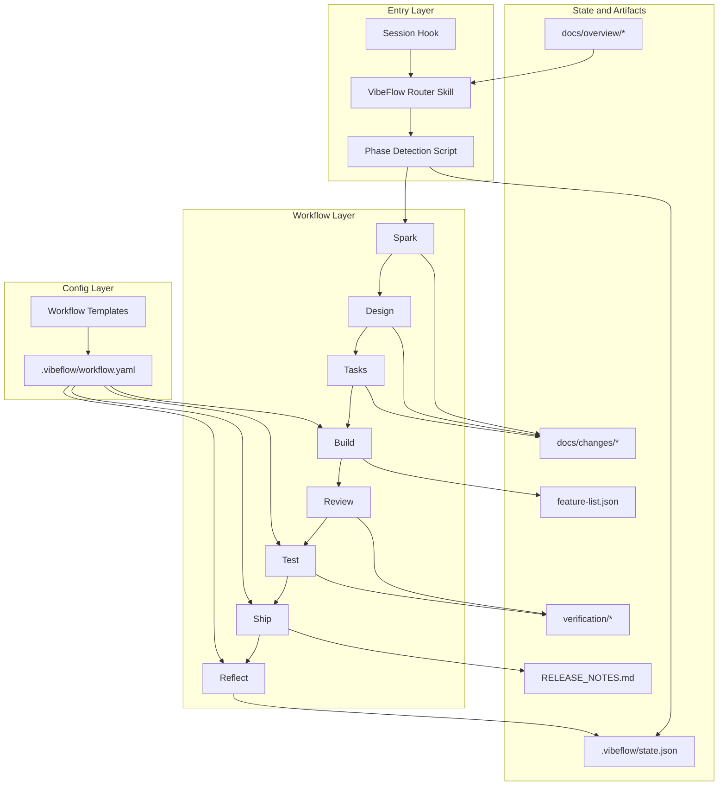

# VibeFlow Architecture

## Related Docs

- [README.md](README.md) - 项目介绍、安装和用户入口
- [USAGE.md](USAGE.md) - 实际使用方式和目标项目操作说明
- [VIBEFLOW-DESIGN.md](VIBEFLOW-DESIGN.md) - 命名、文件布局和实现约定

## 1. Goal

VibeFlow is a repository-local control plane for AI software delivery.

It keeps the workflow state, key artifacts, and verification evidence inside the repo so work can:

- resume after interruption
- hand off across sessions or operators
- stay grounded in files instead of chat memory

The user-facing lifecycle is intentionally compact:

`Spark -> Design -> Tasks -> Build -> Review -> Test -> Ship -> Reflect`

Build and Test may contain internal execution substeps, but those are implementation details rather than user-facing phases.

## 2. Architecture Overview



## 3. Core Model

### 3.1 User-Facing Phases

1. `spark`
2. `design`
3. `tasks`
4. `build`
5. `review`
6. `test`
7. `ship`
8. `reflect`
9. `done`

There is also a special `increment` entry and a `quick` mode path for low-risk changes.

### 3.2 Internal Execution Detail

VibeFlow still uses specialized skills and scripts during Build and Test, but those are not presented as separate product phases.

Examples:

- Build may internally prepare feature inventory before implementation starts
- Test may internally run system testing first and QA only when UI verification is required

This keeps the control plane understandable while preserving execution structure.

## 4. State and Recovery

Each target project stores its control-plane state under `.vibeflow/`.

Primary state files:

- `.vibeflow/state.json`
- `.vibeflow/workflow.yaml`
- `.vibeflow/guides/build.md`
- `.vibeflow/guides/services.md` when services apply
- `.vibeflow/logs/session-log.md` when execution starts writing progress
- `.vibeflow/logs/retro-YYYY-MM-DD.md`
- `.vibeflow/increments/queue.json`

Important project artifacts:

- `docs/overview/PROJECT.md`
- `docs/overview/ARCHITECTURE.md`
- `docs/overview/CURRENT-STATE.md`
- `docs/changes/<change-id>/brief.md`
- `docs/changes/<change-id>/design.md`
- `docs/changes/<change-id>/tasks.md`
- `docs/changes/<change-id>/verification/review.md`
- `docs/changes/<change-id>/verification/system-test.md`
- `docs/changes/<change-id>/verification/qa.md` when UI applies
- `feature-list.json`
- `RELEASE_NOTES.md`

Runtime resume guidance is embedded inside `.vibeflow/state.json`, not stored in a separate runtime file.

When Claude restarts and `/vibeflow` is invoked again, phase detection reconstructs:

- current phase
- why the workflow is paused there
- what to do next
- which files to open first

## 5. Routing Architecture

The router is deterministic and file-driven.

Input:

- `.vibeflow/state.json`
- `.vibeflow/workflow.yaml`
- required artifact presence
- feature execution status in `feature-list.json`

Engine:

- `scripts/get-vibeflow-phase.py`

Output:

- `increment`
- `quick`
- `spark`
- `design`
- `tasks`
- `build`
- `review`
- `test`
- `ship`
- `reflect`
- `done`

Phase detection writes resume guidance back into `.vibeflow/state.json.runtime`.

## 6. Build and Test Execution

### 6.1 Build

Build consumes:

- `design.md`
- `tasks.md`
- `feature-list.json`
- `rules/`
- `.vibeflow/workflow.yaml`

Build is artifact-first:

- design contracts define the intended implementation surface
- tasks provide execution-grade handoff
- feature-list tracks actual execution state and evidence

### 6.2 Review

Review produces:

- `docs/changes/<change-id>/verification/review.md`

### 6.3 Test

Test produces:

- `docs/changes/<change-id>/verification/system-test.md`
- `docs/changes/<change-id>/verification/qa.md` when UI verification is required

## 7. Continuation Model

In Claude Code plugin mode, planning remains interactive until `tasks` is complete.

After the workflow enters `build`, the default behavior is automatic continuation across:

`build -> review -> test -> ship -> reflect`

The system stops only when:

- the workflow is done
- a blocking failure occurs
- a human decision is required

The command-line entrypoint for the same continuation chain is:

```bash
python scripts/run-vibeflow-autopilot.py --project-root <target-project>
```

## 8. Component Responsibilities

### 8.1 Skills Layer

Path: `skills/`

Responsibilities:

- expose the VibeFlow alias surface
- keep lifecycle steps human-readable
- route work into the correct phase behavior

### 8.2 Scripts Layer

Path: `scripts/`

Responsibilities:

- detect workflow phase
- initialize workflow config from templates
- maintain project state and resume hints
- validate repo readiness
- run autopilot and dashboard flows

### 8.3 Templates Layer

Path: `templates/`

Responsibilities:

- provide static workflow presets
- define quality gates and optional finish stages

Templates:

- `prototype`
- `web-standard`
- `api-standard`
- `enterprise`

### 8.4 Hooks Layer

Path: `hooks/`

Responsibilities:

- inject phase-aware context on session start
- display resume reason and next-action guidance

### 8.5 Validation Layer

Path: `validation/`

Responsibilities:

- verify the workflow against independent sample projects
- prove that routing and artifacts work outside this repo

## 9. Design Principles

1. Thin control plane
VibeFlow should guide the workflow, not replace the host agent runtime.

2. File-driven recovery
The system resumes from repository state, not transient memory.

3. Spec before implementation
Build starts after `brief.md`, `design.md`, and `tasks.md` exist.

4. Human-facing simplicity
Users see a compact phase model; internal execution detail stays hidden unless debugging is needed.

5. Artifact truth over conversation truth
Progress, contracts, and verification all live in files.

For the canonical translation between user-facing names and internal implementation names, see the mapping tables in [VIBEFLOW-DESIGN.md](VIBEFLOW-DESIGN.md).

## 10. Validation

The architecture is validated against the independent sample project under:

- `validation/sample-priority-api`

Key checks:

- phase detection follows the macro workflow
- runtime resume hints are embedded in `state.json`
- build/review/test artifacts are sufficient to drive continuation
- the router reaches `done` when required evidence exists

## 11. Risks and Constraints

Current constraints:

- completion still depends on truthful artifact generation
- hooks vary slightly across host environments
- internal build/test skills remain more granular than the user-facing phase model

Primary risk:

- if teams generate artifacts without real execution evidence, the router can report false completion

Mitigation:

- keep review, test, and release artifacts aligned with actual code changes
- keep `feature-list.json` synchronized with real execution state
- continue validating against independent sample projects
