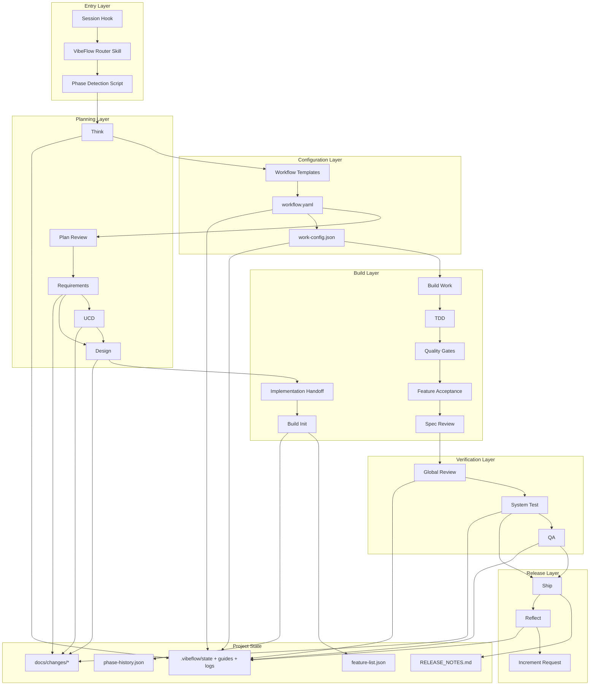
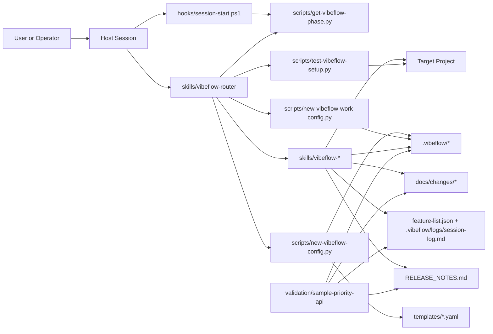
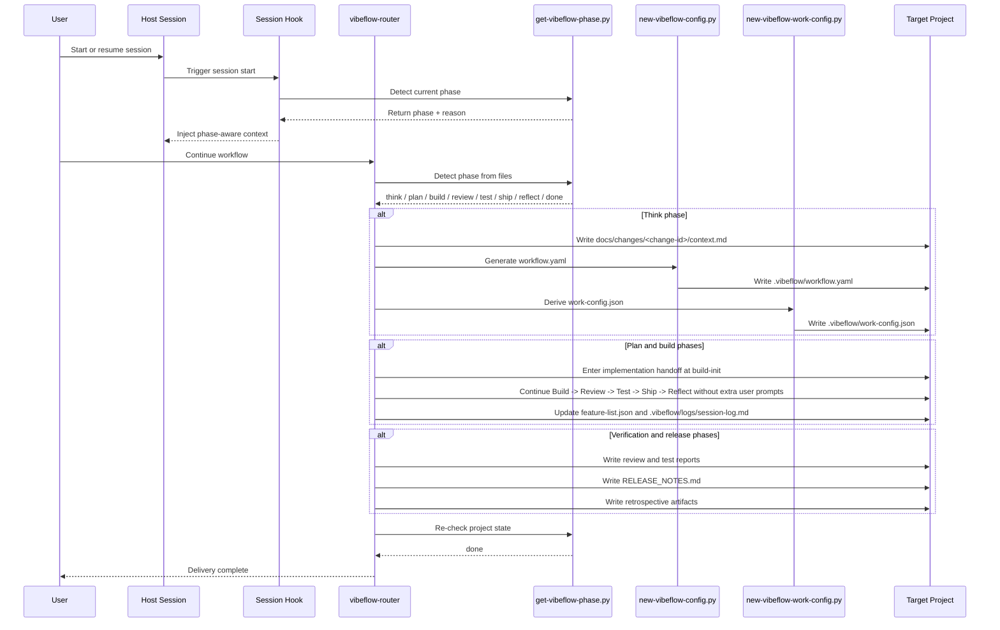

# VibeFlow Architecture

## Related Docs

- [README.md](README.md) - 项目介绍、安装和用户入口
- [USAGE.md](USAGE.md) - 实际使用方式和目标项目操作说明
- [VIBEFLOW-DESIGN.md](VIBEFLOW-DESIGN.md) - 设计契约、命名和文件布局

## 1. Goal

VibeFlow is a repository-local workflow orchestration layer for multi-stage software delivery.
It provides a single naming system, a file-driven phase router, static workflow templates, and a set of local skill aliases that cover the full path from Think to Reflect.

In Claude Code plugin mode, the handoff point is `build-init`: planning remains interactive, while implementation defaults to automatic continuation across Build, Review, Test, Ship, and Reflect. The CLI script is just the command-line entrypoint to that same chain.

The architecture is intentionally split into thin local orchestration and pluggable execution foundations:

- local orchestration owns naming, routing, state files, and template-derived config
- phase execution is expressed through local `vibeflow-*` aliases
- project state is persisted in repo files rather than process memory

## 2. Complete Architecture Flow

## 3. Component Diagram

## 4. Sequence Flow

## 5. Design Principles

1. Vendor-neutral project surface
All project-facing names use `vibeflow` only.

2. File-driven routing
The current phase is inferred from repo state, not chat history.

3. Thin orchestration
Skills in this repo define routing and contracts; implementation details stay in the target project and active execution pipeline.

4. Template-derived behavior
Workflow strictness is selected once and propagated through generated config.

5. Repo-local artifacts
All state needed for recovery or continuation lives in files under the target project.

## 6. Top-Level Components

### 6.1 Skills Layer
Path: `skills/`

Responsibilities:
- expose the VibeFlow alias surface
- separate lifecycle stages into focused skills
- keep routing and phase contracts human-readable

Core skills:
- `vibeflow`
- `vibeflow-router`
- `vibeflow-think`

Plan/build/test/release skills:
- `vibeflow-plan`
- `vibeflow-requirements`
- `vibeflow-ucd`
- `vibeflow-design`
- `vibeflow-build-init`
- `vibeflow-build-work`
- `vibeflow-tdd`
- `vibeflow-quality`
- `vibeflow-feature-st`
- `vibeflow-spec-review`
- `vibeflow-review`
- `vibeflow-test-system`
- `vibeflow-test-qa`
- `vibeflow-ship`
- `vibeflow-reflect`

### 6.2 Scripts Layer
Path: `scripts/`

Responsibilities:
- detect workflow phase
- generate workflow config from templates
- derive build work-config from workflow settings
- validate repo readiness

Key scripts:
- `get-vibeflow-phase.py`
- `new-vibeflow-config.py`
- `new-vibeflow-work-config.py`
- `test-vibeflow-setup.py`

### 6.3 Templates Layer
Path: `templates/`

Responsibilities:
- provide static workflow presets
- define quality gates and required stages
- avoid dynamic schema generation

Templates:
- `prototype`
- `web-standard`
- `api-standard`
- `enterprise`

### 6.4 Hooks Layer
Path: `hooks/`

Responsibilities:
- inject phase-aware session context
- bridge host hook entrypoints to Python routing logic

Files:
- `hooks.json`
- `session-start.ps1`

### 6.5 Validation Layer
Path: `validation/`

Responsibilities:
- hold independent sample projects used to verify VibeFlow end-to-end
- prove workflow execution without using the VibeFlow repo itself as the delivery target

Current validation project:
- `validation/sample-priority-api`

## 7. State Model

Each target project stores runtime state under `.vibeflow/`.

Primary state files:
- `.vibeflow/state.json`
- `.vibeflow/workflow.yaml`
- `.vibeflow/work-config.json`
- `.vibeflow/guides/build.md`
- `.vibeflow/guides/services.md`
- `.vibeflow/logs/session-log.md`
- `.vibeflow/logs/retro-YYYY-MM-DD.md`
- `.vibeflow/increments/queue.json`

Project delivery artifacts remain in conventional paths:
- `docs/changes/<change-id>/context.md`
- `docs/changes/<change-id>/proposal.md`
- `docs/changes/<change-id>/requirements.md`
- `docs/changes/<change-id>/ucd.md`
- `docs/changes/<change-id>/design.md`
- `docs/changes/<change-id>/design-review.md`
- `docs/changes/<change-id>/verification/review.md`
- `docs/changes/<change-id>/verification/system-test.md`
- `docs/changes/<change-id>/verification/qa.md`
- `docs/test-cases/feature-*.md`
- `feature-list.json`
- `RELEASE_NOTES.md`

## 8. Routing Architecture

The router is implemented as a deterministic state machine.

Input:
- target project root
- generated workflow state
- presence or absence of required artifacts

Engine:
- `scripts/get-vibeflow-phase.py`

Output phases:
1. `increment`
2. `think`
3. `template-selection`
4. `plan`
5. `requirements`
6. `design`
7. `build-init`
8. `build-config`
9. `build-work`
10. `review`
11. `test-system`
12. `test-qa`
13. `ship`
14. `reflect`
15. `done`

### 8.1 Detection Strategy

Phase detection is based on file existence and feature status:
- missing think output means the project is still in Think
- missing workflow file means template selection is incomplete
- missing plan or design artifacts push the router into planning
- missing feature inventory or non-passing features push into build
- missing review or test reports push into post-build validation
- missing release notes or retrospective keep the project out of `done`

This design makes resuming a session deterministic and recoverable.

## 9. Configuration Flow

### 9.1 Workflow Generation
`new-vibeflow-config.py` copies a selected template into `.vibeflow/workflow.yaml` and stamps the date.

### 9.2 Build Config Generation
`new-vibeflow-work-config.py` derives `.vibeflow/work-config.json` from `workflow.yaml`.

Derived fields include:
- enabled build steps
- quality thresholds
- test requirements
- reflect requirement

This keeps build execution aligned with the chosen template.

## 10. Delivery Flow

The intended lifecycle is:

Think -> Plan Review -> Requirements -> UCD (if needed) -> Design -> Build Init -> Build Work -> Review -> Test -> Ship -> Reflect

### 10.1 Think
Produces problem framing and template recommendation.

### 10.2 Plan
Produces SRS, UCD, and design documents.

### 10.3 Build
Produces feature inventory, implementation, progress logs, and per-feature evidence.

### 10.4 Review and Test
Produces global review notes, system test reports, and optional QA evidence.

### 10.5 Ship and Reflect
Produces release notes and retrospective artifacts.

## 11. Validation Architecture

The architecture is validated using an independent sample project rather than the VibeFlow repo itself.

Sample validation target:
- `validation/sample-priority-api`

Validated properties:
- workflow starts from Think
- workflow config and work-config can be generated externally
- planning artifacts can be produced in the target project
- build/test/release artifacts are recognized by the router
- the router reaches `done` after delivery evidence is present

## 12. Extension Model

Future additions should preserve these boundaries:
- new phases should extend the router and add explicit artifacts
- new templates should be added as static YAML files
- new validation projects should live under `validation/`
- host-specific integration may evolve in hooks, but orchestration logic should stay in Python scripts

## 13. Risks and Constraints

Current constraints:
- hooks are still entered through PowerShell on Windows hosts
- phase execution aliases are documented contracts, not hard-coded engine integrations
- artifact presence is a strong but lightweight proxy for completion

Primary risk:
- if teams generate artifacts without real execution evidence, the router can report false completion

Mitigation:
- keep tests, feature inventory, release notes, and review reports aligned with actual code changes
- continue validating on independent sample projects
