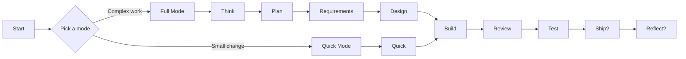

**[中文](README.md) | English**

---

# VibeFlow

**Make AI ship software with engineering discipline, not chaotic improv.**

AI is great at writing code.  
AI is also great at forgetting context, skipping steps, and confidently sprinting into a wall.

VibeFlow gives it a delivery system with **file-based state, deterministic routing, reusable artifacts, and quality gates that actually mean something**.

> Think of it as guardrails, a map, and a memory system for AI-driven software delivery.

## Flow At A Glance



Use Full Mode when the work is fuzzy, risky, or broad.  
Use Quick Mode when the change is small, easy to verify, and easy to roll back.

## Why It Exists

Without a real workflow, AI coding usually looks like this:

- session changes and the project loses its mind
- requirements live in chat, design lives nowhere, code shows up first
- a "tiny fix" quietly turns into a half-rewrite
- testing, review, and release notes happen only if someone remembers

VibeFlow is built to solve exactly that:

- **Persistent state** in repo files, not in conversation memory
- **Deterministic routing** so every session knows the next step
- **Two execution modes**: Full Mode for serious work, Quick Mode for bounded changes
- **Template-controlled strictness** from prototype to enterprise
- **Increment-friendly flow** for real-world ongoing codebases

## What The Refactor Actually Changed

The current layout is centered on a cleaner split of responsibilities:

- `.vibeflow/state.json`
  central workflow state: mode, phase, active change, checkpoints
- `docs/changes/<change-id>/...`
  complete work-package artifacts: `context / proposal / requirements / design / tasks / verification`
- `feature-list.json`
  single source of truth during Build
- `.vibeflow/increments/*`
  increment queue, request payloads, and history
- `scripts/migrate-vibeflow-v2.py`
  migration path from the legacy layout

In short: **state is state, docs are docs, build inventory is build inventory.**

## Modes

### Full Mode

Use it for:

- new features
- architecture changes
- substantial existing-project changes
- UI, auth, security, or data-impacting work
- anything fuzzy enough to need thinking before typing

Flow:

`Think -> Plan -> Requirements -> Design -> Build -> Review -> Test -> Ship? -> Reflect?`

### Quick Mode

Use it for:

- bug fixes
- small scoped changes
- config updates
- docs/tests/scaffold repairs
- work that is easy to verify and easy to roll back

Flow:

`Quick -> Build -> Review -> Test -> Ship? -> Reflect?`

Quick Mode keeps a minimal design and verification trail.  
It is a **fast delivery mode**, not a **YOLO mode**.

## How It Works

### 1. Pick a mode

- `/vibeflow` for Full Mode
- `/vibeflow-quick` for Quick Mode

### 2. Let the router drive

`vibeflow-router` reads the repo state and routes the session to the right phase.  
It does not guess what happened last time. It reads the evidence.

### 3. Persist everything important

The key layout now looks like this:

```text
.vibeflow/
  state.json
  workflow.yaml
  work-config.json
  increments/
  logs/

docs/changes/<change-id>/
  context.md
  proposal.md
  requirements.md
  ucd.md
  design.md
  design-review.md
  tasks.md
  verification/
    review.md
    system-test.md
    qa.md

feature-list.json
RELEASE_NOTES.md
```

## Install

The homepage keeps the shortest path first. Installation docs should not feel like a side quest.

### Claude Code

macOS / Linux:

```bash
curl -fsSL https://raw.githubusercontent.com/ttttstc/vibeflow/main/claude-code/install.sh | bash
```

Windows PowerShell:

```powershell
irm https://raw.githubusercontent.com/ttttstc/vibeflow/main/claude-code/install.ps1 | iex
```

Then activate:

```text
/plugin install vibeflow@vibeflow
```

### Want the laziest Windows path?

Use the launcher:

```powershell
irm https://raw.githubusercontent.com/ttttstc/vibeflow/main/claude-code/vibeflow-launcher.ps1 | iex
```

### Need more install detail?

See:

- [`claude-code/install.sh`](claude-code/install.sh)
- [`claude-code/install.ps1`](claude-code/install.ps1)
- [`claude-code/install-simple.ps1`](claude-code/install-simple.ps1)
- [`claude-code/INSTALL-PROMPT.md`](claude-code/INSTALL-PROMPT.md)
- [`install.sh`](install.sh)

## Get Started In 3 Minutes

1. Install and activate VibeFlow in Claude Code
2. Run `/vibeflow` for a new project or complex task
3. Run `/vibeflow-quick` for a small bounded change
4. Follow the router instead of hand-driving the process
5. Let artifacts accumulate under `.vibeflow/` and `docs/changes/`

## Templates

Templates control governance strictness, not your level of ambition.

| Template | Best for |
|---|---|
| `prototype` | POCs, MVPs, internal experiments |
| `web-standard` | standard web applications |
| `api-standard` | backend APIs and services |
| `enterprise` | high-governance, high-audit systems |

Template selection writes `.vibeflow/workflow.yaml`, and execution trimming is derived into `.vibeflow/work-config.json`.

## Core Capabilities

- **7-phase main flow**: Think, Plan, Requirements, Design, Build, Review, Test
- **Optional release phases**: Ship and Reflect
- **Deterministic routing** based on repo files
- **Increment support** for ongoing product work
- **Migration tooling** for the legacy layout
- **Quick / Full dual-mode delivery** with traceability in both

## Docs

- [ARCHITECTURE.md](ARCHITECTURE.md): system architecture and boundaries
- [USAGE.md](USAGE.md): how to use VibeFlow in a target project
- [VIBEFLOW-DESIGN.md](VIBEFLOW-DESIGN.md): design contract, state model, skill catalog

## Who This Is For

Good fit if you want:

- multi-session AI development without re-explaining the repo every time
- AI that follows a delivery process, not just code generation
- safe incremental work inside existing repositories

Probably not a fit if you want:

- instant code snippets with no process
- "tests and review are optional vibes"

## License

MIT
