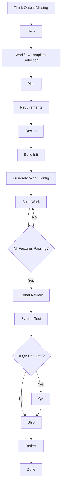

# VibeFlow Usage

## Related Docs

- [README.md](README.md) - 先看项目介绍、安装方式和快速开始
- [ARCHITECTURE.md](ARCHITECTURE.md) - 看状态机、路由和组件关系
- [VIBEFLOW-DESIGN.md](VIBEFLOW-DESIGN.md) - 看命名规则、文件布局和实现约定

## 1. Target Project Layout

A target project is expected to accumulate these artifacts over time:

- `.vibeflow/state.json`
- `.vibeflow/workflow.yaml`
- `.vibeflow/work-config.json`
- `.vibeflow/guides/build.md`
- `.vibeflow/guides/services.md` when services apply
- `.vibeflow/logs/session-log.md`
- `.vibeflow/logs/retro-YYYY-MM-DD.md`
- `.vibeflow/increments/queue.json`
- `docs/changes/<change-id>/context.md`
- `docs/changes/<change-id>/proposal.md`
- `docs/changes/<change-id>/requirements.md`
- `docs/changes/<change-id>/ucd.md` when UI applies
- `docs/changes/<change-id>/design.md`
- `docs/changes/<change-id>/design-review.md`
- `docs/changes/<change-id>/tasks.md`
- `docs/changes/<change-id>/verification/review.md`
- `docs/changes/<change-id>/verification/system-test.md`
- `docs/changes/<change-id>/verification/qa.md` when UI applies
- `feature-list.json`
- `RELEASE_NOTES.md`

## 2. Workflow Templates

Available templates:

- `prototype`
- `web-standard`
- `api-standard`
- `enterprise`

Generate workflow:

```bash
python scripts/new-vibeflow-config.py --template api-standard --project-root <target-project>
```

Generate build config:

```bash
python scripts/new-vibeflow-work-config.py --project-root <target-project>
```

## 3. Phase Detection

Detect the active phase:

```bash
python scripts/get-vibeflow-phase.py --project-root <target-project> --json
```

Possible phases:

- `increment`
- `think`
- `template-selection`
- `plan`
- `requirements`
- `design`
- `build-init`
- `build-config`
- `build-work`
- `review`
- `test-system`
- `test-qa`
- `ship`
- `reflect`
- `done`

## 4. Full Flow Diagram



In Claude Code plugin mode, reaching `build-init` is the handoff point where the system keeps advancing the delivery chain automatically. The router should keep advancing Build, Review, Test, Ship, and Reflect without waiting for a new user prompt between each subphase. If you are running the workflow from the command line, you can continue the same chain with:

```bash
python scripts/run-vibeflow-autopilot.py --project-root <target-project>
```

## 5. Example Validation

The repository includes an independent sample project:

- `validation/sample-priority-api`

Run checks:

```bash
python -m unittest discover -s validation/sample-priority-api/tests -v
python scripts/get-vibeflow-phase.py --project-root validation/sample-priority-api --json
python scripts/test-vibeflow-setup.py --project-root validation/sample-priority-api --json
```
