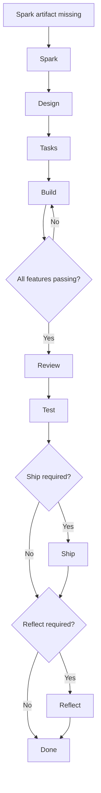

# VibeFlow Usage

## Related Docs

- [README.md](README.md) - 先看项目介绍、安装方式和快速开始
- [ARCHITECTURE.md](ARCHITECTURE.md) - 看状态机、路由和组件关系
- [VIBEFLOW-DESIGN.md](VIBEFLOW-DESIGN.md) - 看命名规则、文件布局和实现约定

## 1. Target Project Layout

A target project is expected to accumulate these artifacts over time:

- `rules/`
- `.vibeflow/state.json`
- `.vibeflow/workflow.yaml`
- `.vibeflow/guides/build.md`
- `.vibeflow/guides/services.md` when services apply
- `.vibeflow/logs/session-log.md` when build automation starts writing progress
- `.vibeflow/logs/retro-YYYY-MM-DD.md`
- `.vibeflow/increments/queue.json`
- `docs/overview/PROJECT.md`
- `docs/overview/ARCHITECTURE.md`
- `docs/overview/CURRENT-STATE.md`
- `docs/changes/<change-id>/brief.md`
- `docs/changes/<change-id>/ucd.md` when UI applies
- `docs/changes/<change-id>/design.md`
- `docs/changes/<change-id>/tasks.md`
- `docs/changes/<change-id>/verification/review.md`
- `docs/changes/<change-id>/verification/system-test.md`
- `docs/changes/<change-id>/verification/qa.md` when UI applies
- `feature-list.json`
- `RELEASE_NOTES.md`

Build evidence artifacts:

- `.vibeflow/build-reports/feature-*.md`

## 2. Workflow Templates

Available templates:

- `prototype`
- `web-standard`
- `api-standard`
- `enterprise`

Generate workflow:

```bash
python scripts/new-vibeflow-config.py --template api-standard --project-root <target-project>
```

## 3. Phase Detection

Detect the active phase:

```bash
python scripts/get-vibeflow-phase.py --project-root <target-project> --json
```

Possible phases:

- `increment`
- `quick`
- `spark`
- `design`
- `tasks`
- `build`
- `review`
- `test`
- `ship`
- `reflect`
- `done`

The JSON output also includes recovery hints such as:

- `reason`
- `next_action`
- `open_files`
- `resume_mode`

## 4. Full Flow Diagram



In Claude Code plugin mode, reaching `build` is the handoff point where the system keeps advancing the delivery chain automatically.

The router should keep advancing:

`build -> review -> test -> ship -> reflect`

without waiting for a new user prompt between those phases.

If you are running the workflow from the command line, you can continue the same chain with:

```bash
python scripts/run-vibeflow-autopilot.py --project-root <target-project>
```

## 5. Build Inputs

Build is artifact-first. Its main inputs are:

- `design.md`
- `tasks.md`
- `feature-list.json`
- `rules/`
- `.vibeflow/workflow.yaml`

Per-feature execution evidence is written back into `feature-list.json` and mirrored as markdown reports under `.vibeflow/build-reports/`.

## 6. Resume Behavior

If Claude closes unexpectedly, rerunning `/vibeflow` restores the workflow from repo state.

The user should be told:

- current phase
- why the workflow is paused
- what to do next
- which files to open first

## 7. Example Validation

The repository includes an independent sample project:

- `validation/sample-priority-api`

Run checks:

```bash
python -m unittest discover -s validation/sample-priority-api/tests -v
python scripts/get-vibeflow-phase.py --project-root validation/sample-priority-api --json
python scripts/test-vibeflow-setup.py --project-root validation/sample-priority-api --json
python scripts/run_vibeflow_repo_tests.py
```
