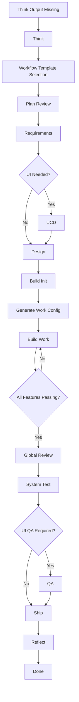

# VibeFlow Usage

## 1. Target Project Layout

A target project is expected to accumulate these artifacts over time:

- `.vibeflow/think-output.md`
- `.vibeflow/workflow.yaml`
- `.vibeflow/work-config.json`
- `.vibeflow/plan-review.md`
- `.vibeflow/review-report.md`
- `.vibeflow/qa-report.md` when UI applies
- `.vibeflow/retro-YYYY-MM-DD.md`
- `docs/plans/*-srs.md`
- `docs/plans/*-ucd.md` when UI applies
- `docs/plans/*-design.md`
- `docs/plans/*-st-report.md`
- `feature-list.json`
- `task-progress.md`
- `RELEASE_NOTES.md`

## 2. Workflow Templates

Available templates:

- `prototype`
- `web-standard`
- `api-standard`
- `enterprise`

Generate workflow:

```bash
python scripts/new-vibeflow-config.py --template api-standard --project-root <target-project>
```

Generate build config:

```bash
python scripts/new-vibeflow-work-config.py --project-root <target-project>
```

## 3. Phase Detection

Detect the active phase:

```bash
python scripts/get-vibeflow-phase.py --project-root <target-project> --json
```

Possible phases:

- `increment`
- `think`
- `template-selection`
- `plan-review`
- `requirements`
- `ucd`
- `design`
- `build-init`
- `build-config`
- `build-work`
- `review`
- `test-system`
- `test-qa`
- `ship`
- `reflect`
- `done`

## 4. Full Flow Diagram



## 5. Example Validation

The repository includes an independent sample project:

- `validation/sample-priority-api`

Run checks:

```bash
python -m unittest discover -s validation/sample-priority-api/tests -v
python scripts/get-vibeflow-phase.py --project-root validation/sample-priority-api --json
python scripts/test-vibeflow-setup.py --project-root validation/sample-priority-api --json
```
