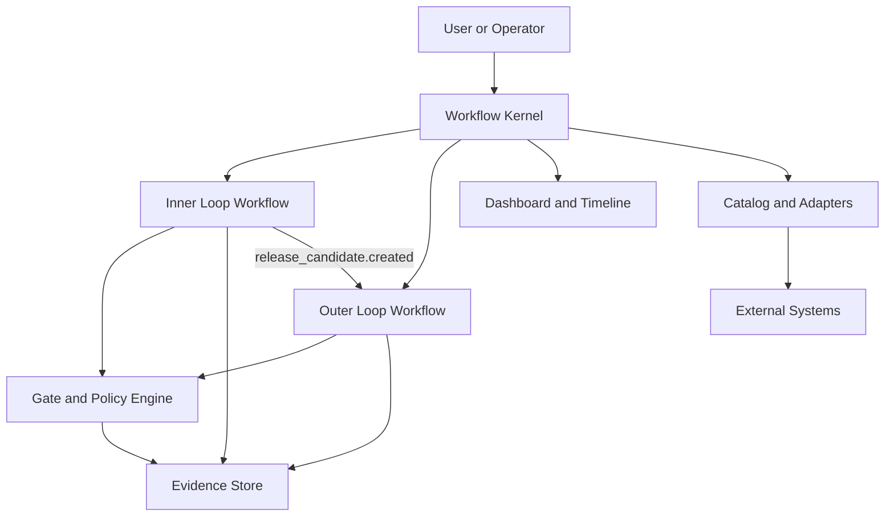

# VibeFlow 内外环研发工作流扩展方案

> 日期：2026-03-25
> 状态：Proposal
> 适用对象：VibeFlow 框架自身演进

## 1. 背景

VibeFlow 当前已经具备较强的软件交付内环基础能力：

- 以仓库本地文件作为状态源
- 通过 `get-vibeflow-phase.py` 做确定性阶段路由
- 以模板控制流程严格度
- 在 `build-init` 之后默认进入自动实施闭环
- 提供 runtime、dashboard、autopilot、feature inventory 等构件

当前框架的优势，是把 AI 从“随机写代码”约束成“按阶段交付软件”。

当前框架的边界，也同样明确：

- 主对象仍然是单个 `active_change`
- 主流程仍然是固定的 7 阶段软件交付链路
- 自动化主要聚焦在需求到测试完成的交付内环
- `ship` 更偏向发布收尾，不是完整的 CI/CD 与门禁发布系统
- 对外部系统的集成、事件回流、环境状态、发布策略、回滚策略还未形成统一模型

因此，VibeFlow 的下一阶段演进目标，不应是简单地在 `Ship` 后继续追加几个阶段，而是把 VibeFlow 从“单条软件交付流程编排器”升级为“支持研发活动内外环闭环运转的工作流平台”。

---

## 2. 目标

本方案要实现的目标如下：

1. 支持研发活动的内环和外环。
2. 内环和外环都可编排、可管理、可恢复、可追踪。
3. 内环和外环可以独立运行，也可以通过契约自动串联。
4. 内外环都保留文件即状态的核心哲学，同时允许接入外部系统事件。
5. 保留当前 7 阶段交付能力，避免对现有用户心智和仓库结构造成一次性破坏。
6. 为后续扩展多服务、多环境、多流水线、多团队协作打基础。

---

## 3. 范围定义

### 3.1 内环

内环指从想法到研发交付完成的链路，覆盖：

- Idea / Think
- Value / Plan
- Requirements
- Design
- Build
- Review
- Test
- Release Candidate 准备

内环的产出，不再只是“代码写完了”，而是一个结构化的 `release-candidate`。

### 3.2 外环

外环指从流水线定义到构建发布自动化闭环的链路，覆盖：

- Pipeline Blueprint
- CI Build
- Security / Quality Gates
- Artifact Publish
- Environment Deploy
- Approval / Change Control
- Post-Deploy Verify
- Promotion / Rollback

外环的目标，不只是“触发 CI”，而是形成一条有策略、有证据、有门禁、有回滚的发布闭环。

### 3.3 独立运行要求

内环独立运行时：

- 团队可只使用需求、设计、开发、测试和 RC 产出能力
- 不依赖企业级 CI/CD 平台也能跑通

外环独立运行时：

- 团队可直接基于现有 tag、artifact、image 或 release candidate 运行发布工作流
- 不依赖 VibeFlow 内环必须参与

---

## 4. 核心判断

### 4.1 不建议继续沿用“固定 phase 串长”

如果把外环直接接在当前 `Ship` 后面，会出现以下问题：

- 内环和外环的运行节奏不同
- 外环大量节点依赖外部系统状态，不适合仅靠 repo 内文件存在性判断
- 外环往往需要多环境、多审批、多策略分支，不适合用线性阶段表示
- 发布失败后的恢复路径，与开发失败后的恢复路径并不相同

因此，外环不应被建模为 `Ship++`。

### 4.2 推荐方向：双环 + 编排内核

推荐把整体系统拆成三层：

1. Workflow Kernel
2. Inner Loop Workflow
3. Outer Loop Workflow

其中：

- `Workflow Kernel` 是统一底座
- `Inner Loop` 和 `Outer Loop` 是两类一等 workflow definition
- 两者通过契约和事件连接，而不是通过固定 phase 硬编码连接

---

## 5. 目标架构



### 5.1 Workflow Kernel

Kernel 负责：

- workflow definition 解析
- workflow instance 生命周期
- node run 调度与恢复
- 事件总线
- gate 判定
- evidence 挂载
- 审批节点
- retry / timeout / fallback 策略
- dashboard 数据汇聚

### 5.2 Inner Loop

Inner Loop 保留当前 VibeFlow 最核心的交付价值：

- 先需求再设计再编码
- 工程纪律优先
- Build 后自动推进
- 按 change 组织工件

### 5.3 Outer Loop

Outer Loop 对接发布平台能力：

- 流水线蓝图定义
- CI 触发与状态回流
- 质量门与安全门
- 部署策略
- 发布审批
- 发布后校验
- 逐环境推进
- 回滚与重新放量

---

## 6. 设计原则

1. 保留“文件即状态”，但允许事件和外部状态回流。
2. 保留 repo-local 优势，但不把外部世界强行压进单一文件路由器。
3. 内环与外环都是一等工作流，不互相从属。
4. 所有 gate 必须结构化，不仅是文档描述。
5. 所有关键裁定都必须附带 evidence。
6. 保持兼容当前 7 阶段体验，先演进，不重写。
7. 第一版优先打通单仓库、单服务、单平台的标准闭环。

---

## 7. 核心对象模型

### 7.1 WorkflowDefinition

描述一类工作流的结构。

建议字段：

```yaml
id: inner-loop-v1
kind: inner-loop
version: 1
entrypoint: think
nodes:
  - id: think
    type: manual
  - id: plan
    type: manual
  - id: requirements
    type: manual
  - id: design
    type: manual
  - id: build
    type: automated
  - id: review
    type: automated
  - id: test
    type: automated
  - id: rc
    type: artifact
edges:
  - from: think
    to: plan
  - from: plan
    to: requirements
```

### 7.2 WorkflowInstance

描述某个工作流的一次实际运行。

建议字段：

```json
{
  "id": "wf-2026-03-25-001",
  "definition_id": "inner-loop-v1",
  "kind": "inner-loop",
  "status": "running",
  "subject": {
    "type": "change",
    "id": "2026-03-25-inner-outer-loop"
  },
  "current_nodes": ["build"],
  "started_at": "2026-03-25T10:00:00+08:00",
  "links": {
    "release_candidate_id": "rc-001",
    "outer_loop_instance_id": null
  }
}
```

### 7.3 NodeRun

表示某个节点的一次执行记录。

建议字段：

- `node_id`
- `run_id`
- `executor_type`
- `status`
- `attempt`
- `started_at`
- `finished_at`
- `inputs`
- `outputs`
- `evidence_refs`
- `verdict`

### 7.4 Event

事件用于连接内外环和外部系统。

推荐基础事件：

- `change.created`
- `plan.approved`
- `design.approved`
- `build.completed`
- `review.passed`
- `test.passed`
- `release_candidate.created`
- `pipeline.requested`
- `pipeline.completed`
- `deploy.started`
- `deploy.succeeded`
- `deploy.failed`
- `release.verified`
- `rollback.executed`

### 7.5 Gate

Gate 是策略化的判断对象。

建议字段：

```json
{
  "id": "gate-prod-release",
  "kind": "release",
  "scope": "prod",
  "required": true,
  "rules": [
    "system_test_passed",
    "security_scan_passed",
    "approval_obtained",
    "post_deploy_verify_passed"
  ],
  "status": "pending",
  "evidence_refs": []
}
```

### 7.6 Evidence

Evidence 是支撑裁定的证据。

支持类型：

- 测试报告
- 覆盖率报告
- 安全扫描报告
- 代码评审结论
- 审批记录
- 流水线运行日志摘要
- 部署记录
- 健康检查结果
- 回滚记录

### 7.7 ReleaseCandidate

这是内环交给外环的最关键对象。

建议字段：

```json
{
  "id": "rc-2026-03-25-001",
  "change_id": "2026-03-25-inner-outer-loop",
  "source_workflow_instance": "wf-2026-03-25-001",
  "services": ["vibeflow-api"],
  "version_hint": "0.9.0-rc1",
  "risk_level": "medium",
  "artifacts": [
    {
      "type": "git-ref",
      "value": "refs/heads/codex/inner-outer-loop"
    }
  ],
  "quality_summary": {
    "review": "passed",
    "system_test": "passed",
    "qa": "not-required"
  },
  "rollback_notes": "Revert to previous stable tag if deploy verification fails."
}
```

### 7.8 DeliveryRun

DeliveryRun 是外环一次构建发布执行的聚合对象。

建议包含：

- 目标环境
- 目标服务
- 关联 RC
- 关联 pipeline blueprint
- 当前阶段
- gate 状态
- deploy strategy
- verify 结果
- rollback 结果

---

## 8. 工作流模型

## 8.1 内环工作流

内环建议保持大体结构不变，但把现有 phase 视为 workflow nodes，而不是系统唯一主状态。

推荐内环 v1 节点：

1. `think`
2. `plan`
3. `requirements`
4. `design`
5. `build-init`
6. `build-config`
7. `build-work`
8. `review`
9. `test-system`
10. `test-qa`
11. `release-candidate`
12. `reflect`

新增的关键节点是：

- `release-candidate`

这个节点负责：

- 汇总代码、测试和评审结果
- 形成结构化 RC 描述
- 给外环一个稳定的、可追踪的入口对象

### 8.1.1 内环完成定义

内环完成，不等于已经上线。

内环完成意味着：

- 需求和设计文档齐备
- 实现完成
- 审查通过
- 测试通过
- RC 已生成

### 8.1.2 内环独立运行

如果没有配置外环：

- RC 生成后即可视为交付完成
- 用户仍可选择手动执行发布
- dashboard 将标记为 `inner-loop completed / outer-loop not attached`

## 8.2 外环工作流

Outer Loop v1 推荐节点：

1. `pipeline-blueprint`
2. `build-ci`
3. `artifact-verify`
4. `security-gates`
5. `deploy-staging`
6. `verify-staging`
7. `approval-prod`
8. `deploy-prod`
9. `verify-prod`
10. `promote-or-rollback`
11. `release-close`

### 8.2.1 外环完成定义

外环完成，意味着：

- 构建成功
- 关键门禁通过
- 部署到目标环境
- 发布后验证通过
- 如失败则已经完成回滚或停止扩散

### 8.2.2 外环独立运行

可从以下入口启动：

- 现有 release candidate
- 现有 tag
- 现有 image digest
- 手动指定的 build ref

---

## 9. 内外环联动模型

推荐使用“契约 + 事件”的连接方式。

### 9.1 联动方式

1. 内环生成 `release_candidate`
2. Kernel 发出 `release_candidate.created`
3. Outer Loop 根据 routing rule 判断是否自动启动
4. Outer Loop 创建自己的 `workflow_instance`
5. 外环执行结果再回流到 RC 和 change timeline

### 9.2 独立性保障

内环实例与外环实例分开存储：

- 各自有自己的 current nodes
- 各自有自己的 run history
- 各自有自己的 retry 和 blocking reason

只通过以下对象关联：

- `change_id`
- `release_candidate_id`
- `delivery_run_id`

### 9.3 联动策略

建议支持四种模式：

| 模式 | 说明 |
|------|------|
| `inner-only` | 只跑内环 |
| `outer-only` | 只跑外环 |
| `auto-chain` | 内环完成自动触发外环 |
| `manual-chain` | 内环完成后等待人工决定是否进入外环 |

---

## 10. 状态与文件布局

当前 VibeFlow 的状态主要围绕 `.vibeflow/state.json`、`.vibeflow/runtime.json`、`feature-list.json`、`docs/changes/` 展开。

为了支撑内外环，建议演进为如下结构：

```text
.vibeflow/
  state.json
  runtime.json
  workflow-catalog/
    inner-loop-v1.yaml
    outer-loop-v1.yaml
  instances/
    wf-2026-03-25-001.json
    wf-2026-03-25-002.json
  events/
    2026-03-25.log.jsonl
  evidence/
    review/
    test/
    security/
    deploy/
  policies/
    default-gates.yaml
    prod-gates.yaml
  delivery/
    release-candidates/
      rc-2026-03-25-001.json
    runs/
      dr-2026-03-25-001.json
  catalog/
    services.json
    environments.json
    pipelines.json
  adapters/
    github-actions.json
    local-shell.json
  logs/
    session-log.md
    runtime-events.log
docs/
  changes/
    <change-id>/
```

### 10.1 保留项

以下资产建议保留并继续使用：

- `docs/changes/<change-id>/`
- `feature-list.json`
- `.vibeflow/workflow.yaml`
- `.vibeflow/work-config.json`

### 10.2 升级项

以下对象需要从“单实例”升级为“多实例”：

- `state.json`
- `runtime.json`
- dashboard snapshot

---

## 11. state.json 演进建议

当前 `state.json` 以单个 `active_change` 为中心。

建议演进为：

```json
{
  "version": 3,
  "mode": "full",
  "active_change": {
    "id": "2026-03-25-inner-outer-loop",
    "root": "docs/changes/2026-03-25-inner-outer-loop"
  },
  "active_instances": {
    "inner_loop": "wf-2026-03-25-001",
    "outer_loop": "wf-2026-03-25-002"
  },
  "instance_links": {
    "wf-2026-03-25-001": {
      "release_candidate_id": "rc-2026-03-25-001",
      "downstream_instances": ["wf-2026-03-25-002"]
    }
  },
  "compatibility": {
    "legacy_phase_router_enabled": true
  }
}
```

这样做的价值：

- 不破坏当前 change-centered 模型
- 能逐步引入多个 workflow instance
- 能让旧 router 在一段时间内继续工作

---

## 12. Workflow Definition Schema 建议

第一版不要追求过于通用的 DAG 引擎，但要让 schema 足够表达内外环。

建议节点类型：

- `manual`
- `skill`
- `script`
- `adapter`
- `gate`
- `approval`
- `artifact`
- `event-wait`

建议每个节点支持：

```yaml
id: deploy-prod
type: adapter
executor: github-actions
action: deploy
inputs:
  environment: prod
retry:
  max_attempts: 2
on_success:
  emit:
    - deploy.succeeded
on_failure:
  emit:
    - deploy.failed
  next: promote-or-rollback
```

---

## 13. Gate 与 Policy 设计

这是本次升级必须补齐的核心能力之一。

### 13.1 为什么必须结构化

当前质量门更接近 Build 阶段的规则和文档约束。

但外环需要的 gate 包含：

- 环境发布门
- 安全门
- 变更审批门
- 时间窗口门
- 运行时健康门

这些都不能只靠 prompt 描述。

### 13.2 Policy 层建议

定义方式：

```yaml
policy_sets:
  default:
    gates:
      - id: quality-minimum
        type: quality
        requires:
          - review_passed
          - system_test_passed
  prod-release:
    gates:
      - id: prod-safety
        type: release
        requires:
          - security_scan_passed
          - approval_obtained
          - staging_verified
          - rollback_plan_attached
```

### 13.3 Gate verdict 建议

Gate 输出只允许：

- `passed`
- `failed`
- `waived`
- `blocked`

每个 verdict 必须带：

- `reason`
- `evidence_refs`
- `decided_by`
- `decided_at`

---

## 14. 适配器与外部系统

Outer Loop 要真正落地，必须引入 adapter 层。

### 14.1 Adapter 类型

建议支持四类：

1. `local-script`
2. `webhook`
3. `pipeline-provider`
4. `deployment-provider`

### 14.2 第一阶段只做单平台

第一版不建议同时支持：

- GitHub Actions
- GitLab CI
- Jenkins
- ArgoCD
- Flux
- 云厂商原生流水线

推荐 V1 只支持：

- GitHub Actions 作为 pipeline provider
- 本地 shell / script 作为 fallback

### 14.3 适配器职责

Adapter 只负责：

- 触发
- 查询状态
- 拉取摘要结果
- 归档 evidence

业务裁定仍由 Kernel 和 Gate Engine 完成。

---

## 15. Catalog 设计

要做外环，就必须建立目录模型。

建议最小目录对象如下：

### 15.1 Services

```json
[
  {
    "id": "vibeflow-api",
    "repo": "ttttstc/vibeflow",
    "runtime": "python",
    "artifact_type": "container",
    "pipeline_blueprint": "github-actions-standard"
  }
]
```

### 15.2 Environments

```json
[
  {
    "id": "dev",
    "tier": "non-prod"
  },
  {
    "id": "staging",
    "tier": "pre-prod"
  },
  {
    "id": "prod",
    "tier": "prod"
  }
]
```

### 15.3 Pipelines

```json
[
  {
    "id": "github-actions-standard",
    "provider": "github-actions",
    "build_workflow": "build.yml",
    "deploy_workflow": "deploy.yml"
  }
]
```

---

## 16. Dashboard 与管理视图

当前 dashboard 已经能展示 phase、feature、artifact、event。

下一阶段建议升级为双泳道模型。

### 16.1 视图布局

1. 顶部：当前 change 概览
2. 左泳道：Inner Loop
3. 右泳道：Outer Loop
4. 中间：Gate 时间线
5. 底部：Evidence 与 Event 流

### 16.2 关键卡片

- 当前 change
- 当前 RC
- 当前 DeliveryRun
- 当前环境状态
- Gate 总览
- 阻塞项
- 最近事件

### 16.3 必须支持的查询

- 当前 change 到了哪一步
- RC 是否已生成
- 是否已触发外环
- 当前在哪个环境
- 哪个 gate 挡住了
- 最近一次失败发生在哪个节点
- 对应 evidence 是什么

---

## 17. 与当前架构的兼容策略

这是落地成败的关键。

### 17.1 保留当前 phase router

在第一阶段：

- 保留 `get-vibeflow-phase.py`
- 保留 current phase 检测逻辑
- 保留当前 Build 后自动接管语义

但把它视为：

- `inner-loop@v1` 的兼容入口

### 17.2 不立即替换现有模板

先在模板中增加扩展域：

```yaml
workflow_mode: dual-loop
inner_loop:
  definition: inner-loop-v1
outer_loop:
  enabled: false
  definition: outer-loop-v1
release:
  auto_chain: false
```

### 17.3 从单 change 到多 instance 的平滑过渡

迁移顺序：

1. 先引入 `instances/`
2. 再让 `state.json` 记录 active instances
3. 再让 dashboard 读取 instances
4. 最后才考虑弱化单 phase 主导地位

---

## 18. 推荐实施路线

## 阶段 A：内核预备

目标：

- 不改用户体验
- 先把单实例状态模型升级成多实例可扩展模型

交付物：

- `instances/` 目录
- 新版 `state.json`
- runtime 与 dashboard 对 instance 的读取能力
- 兼容当前 router

## 阶段 B：内环产品化

目标：

- 把当前 7 阶段显式包装成 `inner-loop-v1`
- 新增 `release-candidate` 节点

交付物：

- inner-loop workflow definition
- RC schema
- `release_candidate.created` 事件

## 阶段 C：外环 MVP

目标：

- 打通一条标准发布链路

推荐范围：

- 单 repo
- 单 service
- GitHub Actions
- dev / staging / prod 三环境
- staging 验证
- prod 审批
- prod 验证
- rollback

交付物：

- outer-loop workflow definition
- adapter: github-actions
- gate policies
- delivery run records

## 阶段 D：双环看板

目标：

- 让用户真正“看见”内外环闭环

交付物：

- 双泳道 dashboard
- gate timeline
- RC 和 DeliveryRun 卡片

## 阶段 E：多服务与策略扩展

目标：

- 扩展到 monorepo、多服务、不同环境策略

---

## 19. 第一版 MVP 边界

为了避免一开始把范围做成“海洋”，建议明确以下 MVP：

### 19.1 必做

- 内环保持现状并升级为 instance-aware
- 新增 RC 对象
- 新增外环工作流定义
- 新增 GitHub Actions adapter
- 新增 gate / evidence 结构
- 新增 staging 和 prod 的发布闭环

### 19.2 不做

- 多平台流水线适配
- 多团队审批矩阵
- 多集群拓扑编排
- 复杂灰度规则引擎
- 全量 DAG 可视化编辑器
- 企业级权限系统

---

## 20. 风险与应对

### 风险 1：现有用户心智被破坏

应对：

- 保留当前 phase router
- 保留当前 `docs/changes/` 和 `feature-list.json`
- 通过兼容模式逐步迁移

### 风险 2：外环过度依赖外部系统，导致 file-driven 优势下降

应对：

- 关键状态仍落本地文件
- 外部状态只通过 adapter 摘要回流
- evidence 固化到仓库或本地状态目录

### 风险 3：过早做成“通用编排平台”，复杂度爆炸

应对：

- 第一版只支持 `inner-loop-v1` 和 `outer-loop-v1`
- 不追求通用 DAG 编辑器
- 不追求多平台同时支持

### 风险 4：当前底座成熟度不足

应对：

- 先补齐核心 skill、测试、验证脚本
- 再推进外环能力
- 避免在 scaffold 未稳时叠加过多平台能力

---

## 21. 对当前仓库的具体建议

### 21.1 先补底座，再扩边界

当前仓库已有不错的路由、状态、autopilot 和 dashboard 雏形，但也仍有底座成熟度问题。

建议先确保：

- 核心 scripts 测试更完整
- 关键 skills 具备稳定执行协议
- dashboard / runtime 的状态一致性更强

### 21.2 代码层优先改造点

优先改造：

1. `scripts/vibeflow_paths.py`
2. `scripts/vibeflow_automation.py`
3. `scripts/vibeflow_dashboard.py`
4. `templates/*.yaml`

新增：

1. `workflow-catalog/`
2. `delivery/release-candidates/`
3. `delivery/runs/`
4. `policies/`
5. `catalog/`
6. `adapters/`

### 21.3 技术策略

建议继续坚持：

- Python 脚本为主
- repo-local state 为主
- YAML/JSON schema 表达 workflow 和 policy

不建议第一版引入：

- 外部数据库
- 重型消息系统
- 复杂 Web 后端

---

## 22. 结论

VibeFlow 下一阶段最正确的演进，不是把当前 7 阶段继续拉长，而是升级成一个支持研发内外环的编排平台。

其核心结构应当是：

- 一个统一的 Workflow Kernel
- 一个保留当前价值的 Inner Loop
- 一个面向 CI/CD 与门禁发布闭环的 Outer Loop
- 一个把两者串起来的 `ReleaseCandidate + Event + Gate + Evidence` 模型

推荐路线是：

1. 先把当前单 change、单 phase 的状态模型升级成可承载多 workflow instance 的内核。
2. 把当前 7 阶段包装成 `inner-loop-v1`。
3. 先落一条标准化 `outer-loop-v1`，只支持单平台样板链路。
4. 再补双泳道 dashboard 与多服务策略扩展。

这样可以最大化复用现有 VibeFlow 的优势，同时把能力边界从“结构化交付框架”提升到“研发流程编排平台”。

---

## 23. 下一步建议

建议下一步直接产出两份设计工件：

1. `workflow-kernel-schema.md`
2. `outer-loop-v1-design.md`

其中应细化：

- state.json v3 schema
- workflow definition schema
- release candidate schema
- delivery run schema
- gate policy schema
- GitHub Actions adapter contract
- dashboard v2 data contract

如果进入实施阶段，推荐优先顺序如下：

1. 内核状态模型升级
2. RC 对象与事件
3. 外环工作流定义
4. GitHub Actions adapter
5. Gate engine
6. Dashboard v2
