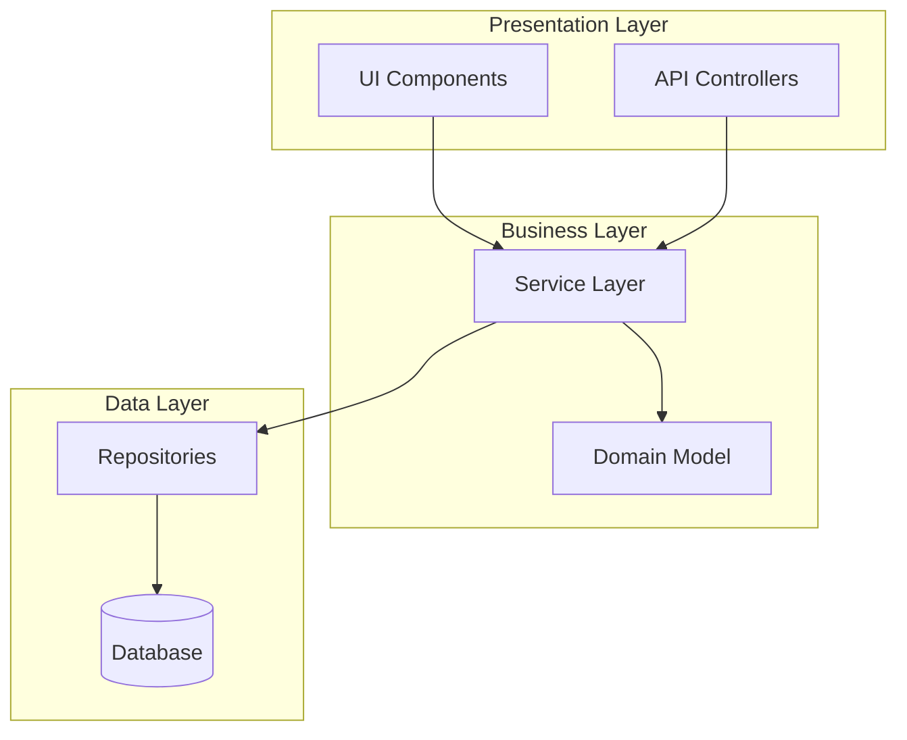
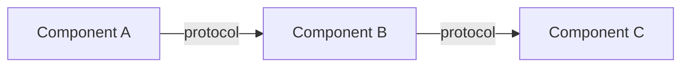
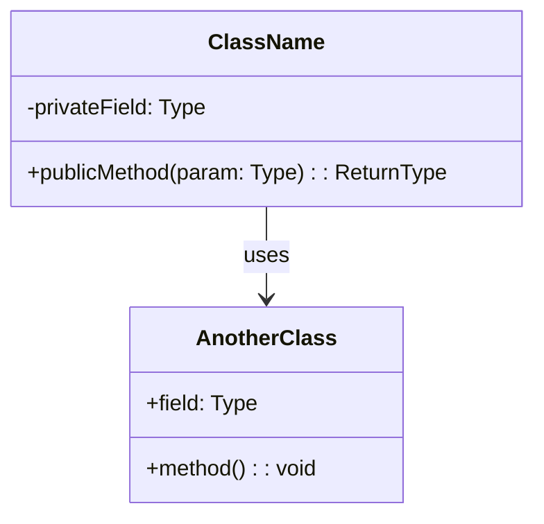
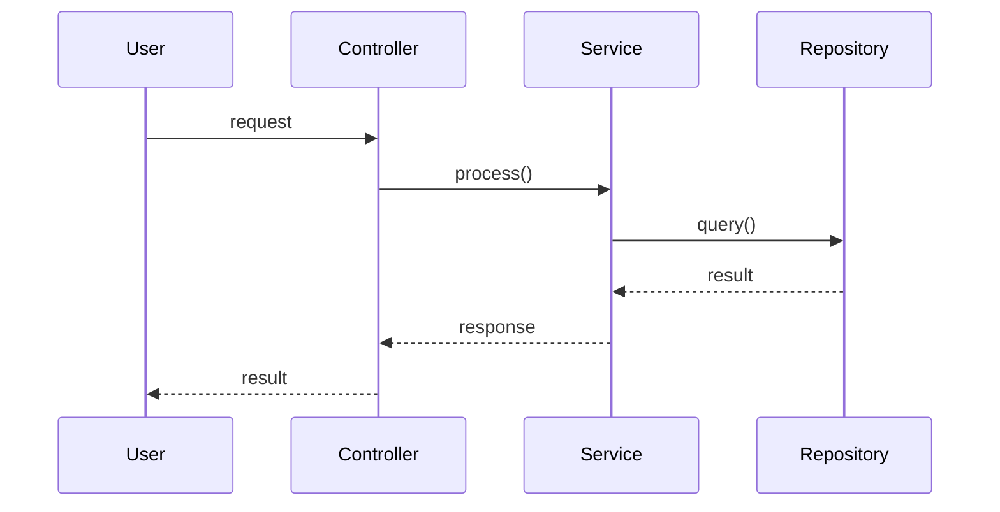
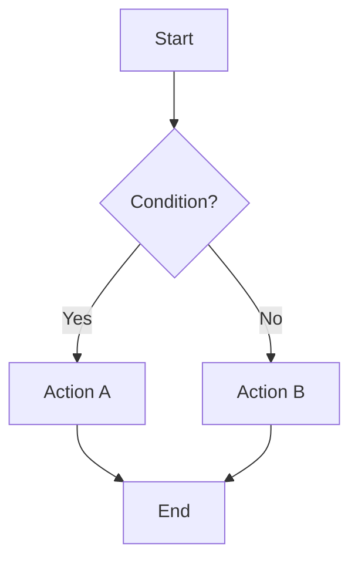
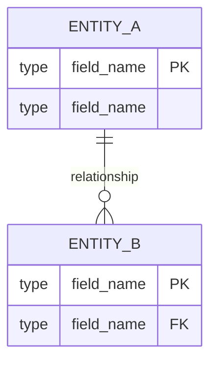
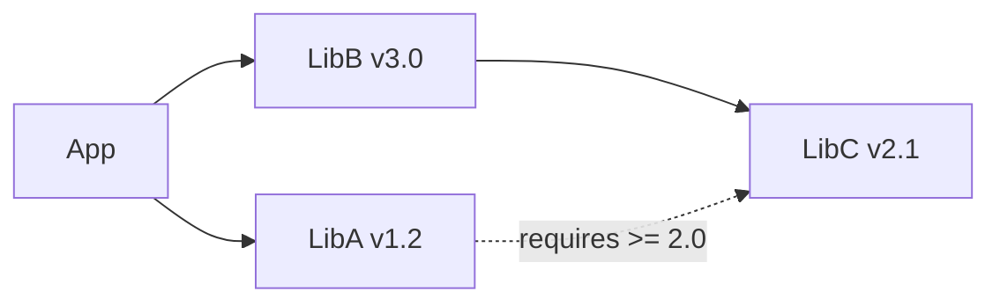
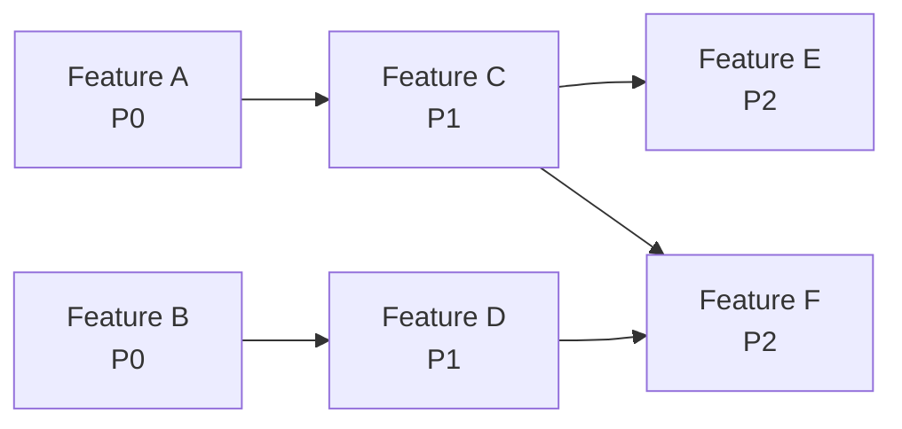

# <Project Name> — Design Document

**Date**: YYYY-MM-DD
**Status**: Approved
**SRS Reference**: docs/plans/YYYY-MM-DD-<topic>-srs.md

## 1. Design Drivers
[Key SRS inputs: NFR thresholds, constraints, interface requirements that shaped this design]

## 2. Approach Selection
[Selected approach with justification. Brief mention of alternatives considered.]

## 3. Architecture

### 3.1 Architecture Overview
[High-level system description: key components, their responsibilities, and interactions]

### 3.2 Logical View
[Describe system decomposition into packages/modules/layers. Show major abstractions and their relationships.]

[Replace the example above with the actual logical architecture of the project. Show layers, packages, modules, and their dependency directions.]

### 3.3 Component Diagram
[Show major runtime components and their interactions]

### 3.4 Tech Stack Decisions
[Justify against SRS constraints and NFRs]
[Explain how NFR thresholds will be met by this architecture]

## 4. Key Feature Designs

> **Instructions**: Create one subsection per key feature (or feature group). Each subsection MUST include at least: a class diagram and one behavioral diagram (sequence or flow). For complex features, include all four views.

### 4.N Feature: <Feature Name> (FR-xxx)

#### 4.N.1 Overview
[1-2 sentences: what this feature does, which SRS requirements it satisfies]

#### 4.N.2 Class Diagram
[Show the classes/modules involved, their attributes, methods, and relationships]

#### 4.N.3 Sequence Diagram
[Show the interaction between objects/components for the main success scenario]

#### 4.N.4 Flow Diagram
[Show the process/logic flow including decision points and error paths]

#### 4.N.5 Design Notes
[Key design decisions, edge cases, error handling strategy for this feature]

[Repeat section 4.N for each key feature or feature group]

## 5. Data Model
[Schemas, relationships, storage strategy]

## 6. API / Interface Design
[Endpoints, contracts, protocols]
[Trace to SRS IFR-xxx requirements]

## 7. UI/UX Approach
[If applicable. Layout strategy, interaction patterns.]
[Omit if no UI features in SRS]

## 8. Third-Party Dependencies

> **Instructions**: List ALL third-party libraries, frameworks, and tools. Each entry MUST specify an exact version (or version range) and compatibility notes.

| Library / Framework | Version | Purpose | License | Compatibility Notes |
|---|---|---|---|---|
| example-lib | 2.3.1 | [purpose] | MIT | Compatible with Python >= 3.10 |
| another-lib | ^4.0.0 | [purpose] | Apache-2.0 | Requires example-lib >= 2.0 |

### 8.1 Version Constraints
[Document any version pinning rationale, known incompatibilities, or upgrade risks]

### 8.2 Dependency Graph
[Show critical dependency relationships if complex]

## 9. Testing Strategy
[Test types, coverage approach, tooling]
[How SRS acceptance criteria map to test suites]

## 10. Deployment / Infrastructure
[If applicable. Hosting, CI/CD, environments.]
[Omit for library/CLI projects]

## 11. Development Plan

### 11.1 Milestones

| Milestone | Target | Scope | Exit Criteria |
|---|---|---|---|
| M1: Foundation | [date/sprint] | Core infrastructure, project skeleton, CI setup | Build passes, dev environment reproducible |
| M2: Core Features | [date/sprint] | [list high-priority features] | All high-priority features passing |
| M3: Extended Features | [date/sprint] | [list medium-priority features] | All medium-priority features passing |
| M4: Polish & Release | [date/sprint] | NFR verification, documentation, examples | All quality gates met, release-ready |

### 11.2 Task Decomposition & Priority

> **Instructions**: Break down features into implementation tasks, ordered by priority and dependency. This feeds directly into `feature-list.json` during Init phase.

| Priority | Feature(s) | Dependencies | Milestone | Rationale |
|---|---|---|---|---|
| P0 - Critical | [Feature A, B] | None | M1 | Foundation required by all others |
| P1 - High | [Feature C, D] | A | M2 | Core value proposition |
| P2 - Medium | [Feature E, F] | C | M3 | Extended functionality |
| P3 - Low | [Feature G] | None | M4 | Nice-to-have |

### 11.3 Dependency Chain
[Show the critical path and feature dependency ordering]

#### Backend→Frontend Dependencies (mandatory for full-stack projects)
The dependency graph MUST explicitly show edges from backend API features to frontend UI features that consume them. This ensures:
- Worker develops backend APIs before frontend pages (dependency satisfaction check in Worker Step 1)
- UI E2E testing via Chrome DevTools MCP has a live backend to test against
- Per-feature ST cases can verify real data flow, not mocked responses

Example: if "User REST API" is Feature A and "User Profile Page" is Feature C, the graph must show `A --> C`.

### 11.4 Risk & Mitigation

| Risk | Impact | Likelihood | Mitigation |
|---|---|---|---|
| [risk description] | High/Med/Low | High/Med/Low | [mitigation strategy] |

## 12. Open Questions / Risks
[Any remaining items to resolve during implementation]
