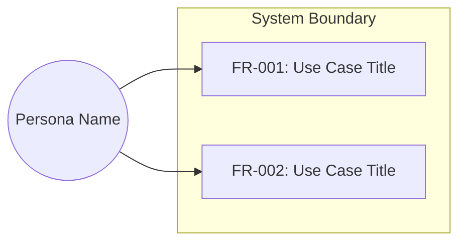
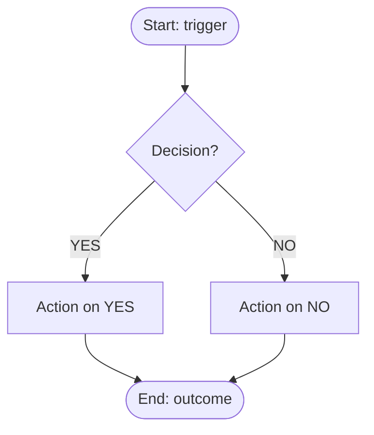

# <Project Name> — Software Requirements Specification

**Date**: YYYY-MM-DD
**Status**: Approved
**Standard**: Aligned with ISO/IEC/IEEE 29148

## 1. Purpose & Scope
[Core problem being solved. System boundaries.]

### 1.1 In Scope
[What the system WILL do in this version]

### 1.2 Out of Scope
[What is explicitly EXCLUDED — deferred or not planned]
[If requirements were deferred during granularity analysis, reference the deferred backlog:
"Deferred requirements tracked in [deferred backlog](YYYY-MM-DD-<topic>-deferred.md)"]

## 2. Glossary & Definitions
| Term | Definition | Do NOT confuse with |
|------|-----------|---------------------|
[Every domain-specific or ambiguous term. Omit section if none.]

## 3. Stakeholders & User Personas
| Persona | Technical Level | Key Needs | Access Level |
|---------|----------------|-----------|--------------|
[Omit if no UI / end-user features]

### 3.1 Use Case View

[Omit this section if no user-facing functional requirements exist]

## 4. Functional Requirements

### FR-001: <Title>
**Priority**: Must
**EARS**: When <trigger>, the system shall <action>.
**Acceptance Criteria**:
- Given <context>, when <action>, then <expected result>
- Given <error context>, when <action>, then <error handling>

[Repeat for each functional requirement]

### 4.1 Process Flows

[One flowchart per functional area with 3+ steps or branching logic — generated during Step 4c]

#### Flow: <Workflow Name>

[Add additional #### Flow sections for each distinct functional area]
[Omit this section if all requirements are single-step with no branching]

## 5. Non-Functional Requirements
| ID | Category (ISO 25010) | Requirement | Measurable Criterion | Measurement Method |
|----|---------------------|-------------|---------------------|-------------------|
| NFR-001 | Performance | Response time | p95 < 200ms | Load test with k6 |
[If none apply, write "None identified" and state why]

## 6. Interface Requirements
| ID | External System | Direction | Protocol | Data Format |
|----|----------------|-----------|----------|-------------|
| IFR-001 | Payment Gateway | Outbound | REST/HTTPS | JSON |
[Omit if no external interfaces]

## 7. Constraints
| ID | Constraint | Rationale |
|----|-----------|-----------|
| CON-001 | Must run on Python 3.8+ | Corporate standard |
[If none, write "None identified"]

## 8. Assumptions & Dependencies
| ID | Assumption | Impact if Invalid |
|----|-----------|------------------|
| ASM-001 | JWT validation handled by API Gateway | Business layer must add validation |
[If none, write "None identified"]

## 9. Acceptance Criteria Summary
[Consolidated table or list linking each FR/NFR to its pass/fail criteria]

## 10. Traceability Matrix
| Requirement ID | Source (stakeholder need) | Verification Method |
|---------------|-------------------------|-------------------|
| FR-001 | User story: "As a user, I want to..." | Automated test |
[Every requirement must appear in this matrix]

## 11. Open Questions
[Any items that need resolution during the design phase. If none, write "None".]
