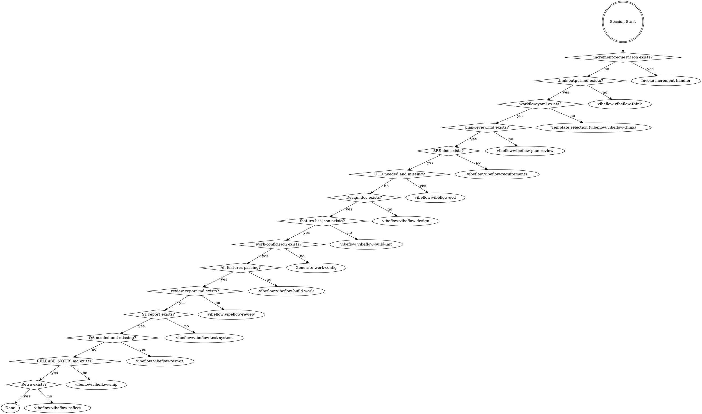

<EXTREMELY-IMPORTANT>
You are in a VibeFlow multi-session project. You MUST invoke the correct phase skill BEFORE any response or action — including clarifying questions.

IF A PHASE SKILL APPLIES, YOU DO NOT HAVE A CHOICE. YOU MUST USE IT.

This is not negotiable. This is not optional. You cannot rationalize your way out of this.
</EXTREMELY-IMPORTANT>

## How to Access Skills

Use the `Skill` tool to invoke skills by name (e.g., `vibeflow:vibeflow-build-work`). When invoked, the skill content is loaded and presented to you — follow it directly. Never use the Read tool on skill files.

## Phase Detection

Run the phase detection script to determine the current session phase:

```bash
python scripts/get-vibeflow-phase.py --project-root . --json
```

Then invoke the corresponding skill based on the detected phase:



**Detection rules (use `get-vibeflow-phase.py` output):**

| Phase | Condition | Skill |
|-------|-----------|-------|
| `increment` | `.vibeflow/increment-request.json` exists | Handle increment |
| `think` | `.vibeflow/think-output.md` missing | `vibeflow:vibeflow-think` |
| `template-selection` | `.vibeflow/workflow.yaml` missing | `vibeflow:vibeflow-think` |
| `plan-review` | `.vibeflow/plan-review.md` missing | `vibeflow:vibeflow-plan-review` |
| `requirements` | No `*-srs.md` in `docs/plans/` | `vibeflow:vibeflow-requirements` |
| `ucd` | UI required, no `*-ucd.md` | `vibeflow:vibeflow-ucd` |
| `design` | No `*-design.md` in `docs/plans/` | `vibeflow:vibeflow-design` |
| `build-init` | `feature-list.json` missing | `vibeflow:vibeflow-build-init` |
| `build-config` | `.vibeflow/work-config.json` missing | Generate work-config |
| `build-work` | Some active features not passing | `vibeflow:vibeflow-build-work` |
| `review` | `.vibeflow/review-report.md` missing | `vibeflow:vibeflow-review` |
| `test-system` | No `*-st-report.md` | `vibeflow:vibeflow-test-system` |
| `test-qa` | UI required, `.vibeflow/qa-report.md` missing | `vibeflow:vibeflow-test-qa` |
| `ship` | `RELEASE_NOTES.md` missing | `vibeflow:vibeflow-ship` |
| `reflect` | No `retro-*.md` | `vibeflow:vibeflow-reflect` |
| `done` | All phases complete | Report completion |

## Skill Catalog

### Phase Skills (invoke ONE based on detection above)
| Skill | Phase | When |
|-------|-------|------|
| `vibeflow:vibeflow-think` | Think | No think-output.md or workflow.yaml |
| `vibeflow:vibeflow-plan-review` | Plan | No plan-review.md |
| `vibeflow:vibeflow-requirements` | Plan | No SRS doc |
| `vibeflow:vibeflow-ucd` | Plan | SRS exists, UI required, no UCD |
| `vibeflow:vibeflow-design` | Plan | SRS (+UCD) exist, no design doc |
| `vibeflow:vibeflow-build-init` | Build | Design exists, no feature-list.json |
| `vibeflow:vibeflow-build-work` | Build | feature-list.json exists, some features failing |
| `vibeflow:vibeflow-review` | Review | All features passing, no review report |
| `vibeflow:vibeflow-test-system` | Test | Review done, no ST report |
| `vibeflow:vibeflow-test-qa` | Test | ST done, UI required, no QA report |
| `vibeflow:vibeflow-ship` | Ship | Tests done, no RELEASE_NOTES.md |
| `vibeflow:vibeflow-reflect` | Reflect | Shipped, no retrospective |

### Discipline Skills (invoked by vibeflow-build-work as sub-skills)
| Skill | Purpose |
|-------|---------|
| `vibeflow:vibeflow-tdd` | TDD Red-Green-Refactor |
| `vibeflow:vibeflow-quality` | Coverage Gate + Mutation Gate |
| `vibeflow:vibeflow-feature-st` | Feature Acceptance Testing |
| `vibeflow:vibeflow-spec-review` | Spec & Design Compliance Review |

## Key Files (shared contract)

| File | Role |
|------|------|
| `docs/plans/*-srs.md` | Approved SRS |
| `docs/plans/*-ucd.md` | Approved UCD style guide (UI projects only) |
| `docs/plans/*-design.md` | Approved design |
| `feature-list.json` | Task inventory — central shared state |
| `task-progress.md` | Session-by-session progress log |
| `RELEASE_NOTES.md` | Living changelog |
| `docs/test-cases/feature-*.md` | Per-feature ST test case documents |
| `docs/plans/*-st-report.md` | System testing report |
| `.vibeflow/increment-request.json` | Signal file for incremental requirements |

## Red Flags

These thoughts mean STOP — you're rationalizing:

| Thought | Reality |
|---------|---------|
| "Let me just look at the code first" | Invoke phase skill first. It tells you HOW to orient. |
| "I know which feature to work on" | Worker skill has Orient step. Follow it. |
| "This feature is simple, skip TDD" | vibeflow-tdd is non-negotiable. |
| "Tests pass, I can mark it done" | vibeflow-quality gates MUST pass first. |
| "Code review is overkill for this" | vibeflow-spec-review runs after EVERY feature. |
| "I remember the workflow" | Skills evolve. Load current version via Skill tool. |
| "I need more context first" | Skill check comes BEFORE exploration. |
| "All features pass, we can ship" | Feature tests != system tests. Run ST phase first. |
