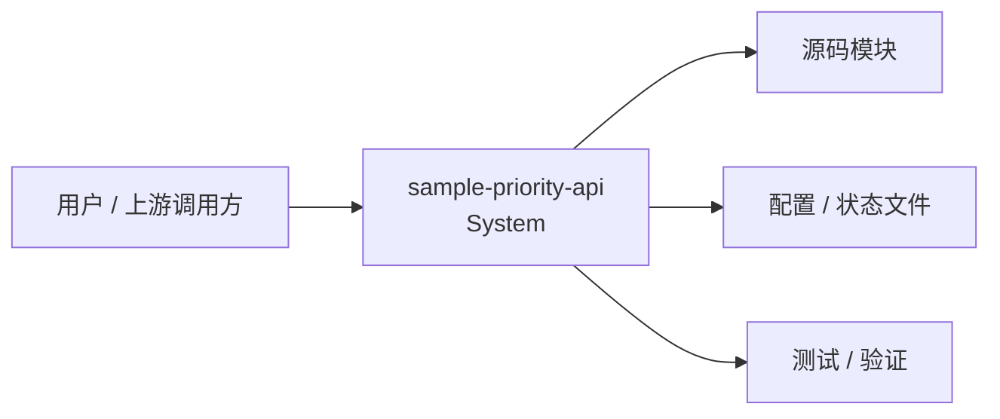
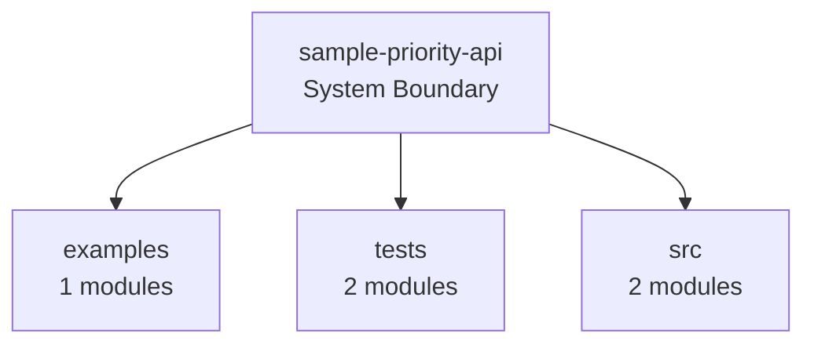
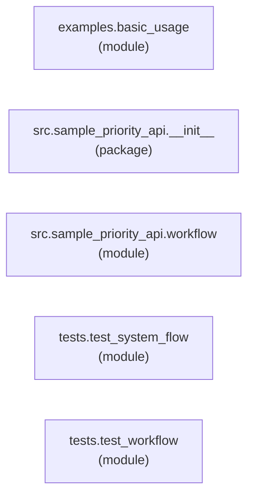
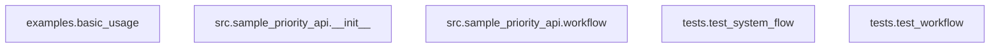
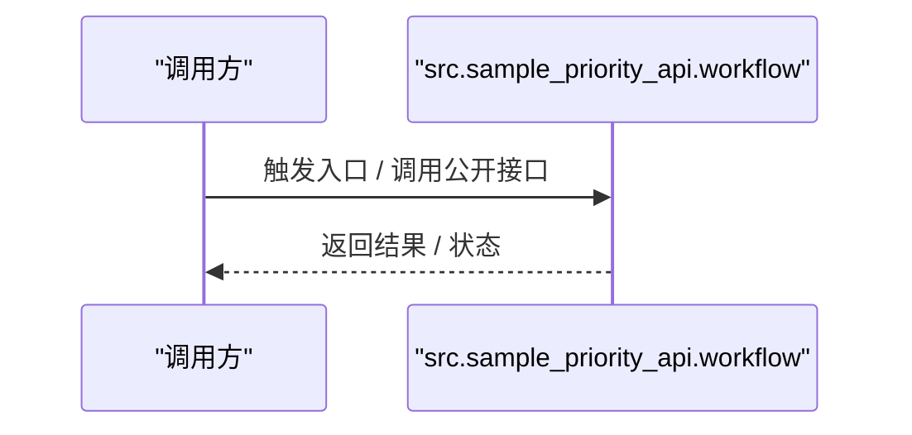
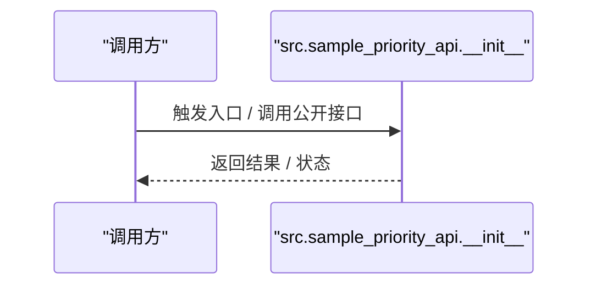
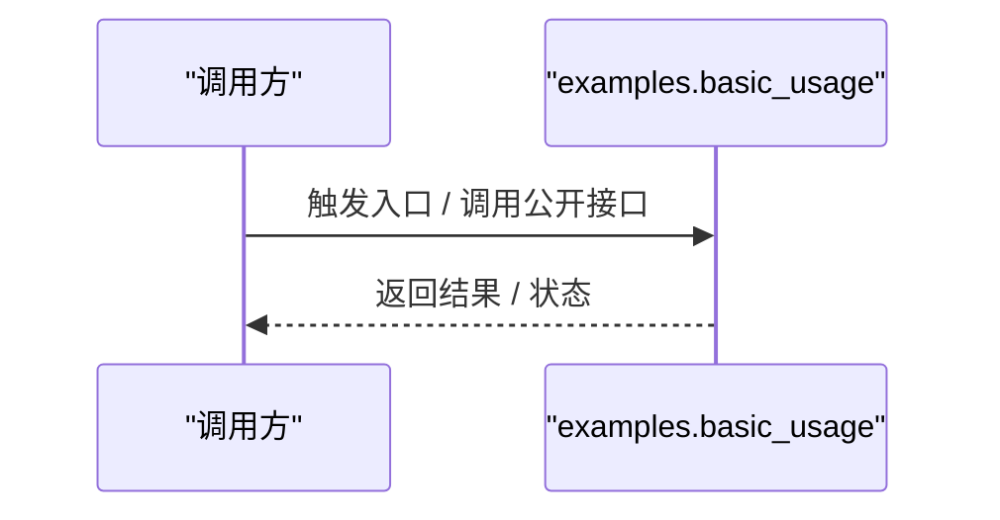
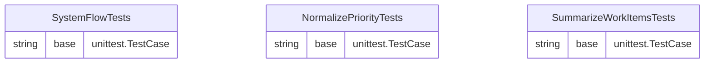

# 架构总览

> 文档类型：工程结构
> 维护方式：人工正文 + 生成区块
> 状态：正式
> 最近审阅：2026-04-06
> 主要输入：源码目录、rules/、feature-list.json

## 架构摘要

- 待补充：用一句话概括当前系统如何组织。

## 技术快照

<!-- 生成区块:技术快照 开始 -->
- 代码事实来源：`live-repo-scan`
- 主要语言：python
- 框架线索：待补充
- 源码根目录：src
- 测试根目录：tests
- 主要模块：sample_priority_api
- 关键入口：待补充
- 深度架构分析：见下方 Arc42 架构视图生成区块
<!-- 生成区块:技术快照 结束 -->

## Arc42 深度架构视图

<!-- 生成区块:Arc42 架构视图 开始 -->
> reverse-spec 生成时间：2026-04-06
> 输出定位：docs/overview/ARCHITECTURE.md 内的生成区块
> 状态：基于静态事实生成；如有人工或 LLM 推断，应以更高置信度信息补充

### 1. 引言与目标

#### 1.1 质量目标
- 待补充：记录可用性、性能、可维护性和可观测性目标。

#### 1.2 相关方
- 开发与维护团队
- 架构评审者
- 未来接手该仓库的协作者 / AI 代理

### 2. 架构约束

#### 2.1 技术约束

#### 2.2 协作约束
- 该文档需要与 docs/overview 下其他正式文档保持一致。
- 生成区块允许自动刷新，人工正文不应被覆盖。

### 3. 系统上下文与范围

#### 3.1 范围说明
- 项目名：sample-priority-api
- 扫描文件数：5
- 识别语言：python

#### 3.2 C4 分层结构

##### 3.2.1 System Context

##### 3.2.2 Container View

##### 3.2.3 Component View

### 4. 解决方案策略

#### 4.1 技术选型
- 未从项目文件中稳定识别到技术栈。

#### 4.2 架构模式
- 以模块/包为中心组织代码结构。
- 通过静态分析抽取模块、API、实体和依赖关系。
- 允许在静态事实之上叠加人工或 LLM 推断，补足职责与运行流说明。

### 5. Building Block View

#### 5.1 模块总览

#### 5.2 模块职责

| 模块 | 职责推断 | 类型 |
|------|----------|------|
| `examples.basic_usage` | 当前识别为 `module`，但仅能从静态结构确认其位于 `examples/basic_usage.py`。 | module |
| `tests.test_system_flow` | 负责测试或验证相关行为；对外主要暴露 `SystemFlowTests` 等接口。 | module |
| `tests.test_workflow` | 负责测试或验证相关行为；封装核心流程或服务编排；对外主要暴露 `NormalizePriorityTests、SummarizeWorkItemsTests` 等接口。 | module |
| `src.sample_priority_api.workflow` | 承接接口或路由暴露；封装核心流程或服务编排；对外主要暴露 `normalize_priority、summarize_work_items` 等接口。 | module |
| `src.sample_priority_api.__init__` | 承接接口或路由暴露；对外主要暴露 `normalize_priority、summarize_work_items` 等接口。 | package |

<!-- LLM-INFERRED: module_responsibilities -->

### 6. Runtime View

#### 6.1 关键运行流

#### 6.1.1 src.sample_priority_api.workflow 驱动链路

- src.sample_priority_api.workflow

#### 6.1.2 src.sample_priority_api.__init__ 驱动链路

- src.sample_priority_api.__init__

#### 6.1.3 examples.basic_usage 驱动链路

- examples.basic_usage

<!-- LLM-INFERRED: runtime_flows -->

### 7. Deployment View

- 执行模型：依据仓库内可见入口运行脚本、服务或前端构建产物。
- 配置来源：项目配置文件、环境变量、状态文件或框架默认约定。
- 持久化线索：以代码中显式声明的数据模型、实体和文件契约为准。

### 8. Concepts

#### 8.1 数据模型

<!-- LLM-INFERRED: data_model_entities -->

#### 8.2 API Surface

##### `src.sample_priority_api.__init__`
- `normalize_priority`
- `summarize_work_items`

##### `src.sample_priority_api.workflow`
- `normalize_priority`
- `summarize_work_items`

##### `tests.test_system_flow`
- `SystemFlowTests`

##### `tests.test_workflow`
- `NormalizePriorityTests`
- `SummarizeWorkItemsTests`

### 9. Architecture Decisions

- 待补充：记录已确认且长期生效的架构决策或 ADR 链接。

### 10. Quality Requirements

- 待补充：将性能、可靠性、安全性等要求补成项目级约束。

### 11. Risks and Technical Debt

| 风险 | 影响 | 缓解思路 |
|------|------|----------|
| 基于装饰器或运行时动态注册的字段/依赖，静态分析可能无法完整识别 | 中 | 结合人工审阅或更高保真推断补充 |
| 运行流来自静态依赖和保守推断，无法完全覆盖真实时序 | 中 | 用 reverse-spec skill 注入 LLM 推断并人工确认 |

### 12. Glossary

| 术语 | 说明 |
|------|------|
| Basic Usage | sample-priority-api 中识别出的模块/概念名 |
| Test System Flow | sample-priority-api 中识别出的模块/概念名 |
| Test Workflow | sample-priority-api 中识别出的模块/概念名 |
| Workflow | sample-priority-api 中识别出的模块/概念名 |
|   Init   | sample-priority-api 中识别出的模块/概念名 |

*Generated by VibeFlow spec_analyzer*
<!-- 生成区块:Arc42 架构视图 结束 -->

## 人工补充

- 待补充：记录业务边界、静态分析无法看出的外部系统契约，以及已确认的长期设计决策。

## 更新规则

- 当目录结构、主要模块、入口点、依赖方向或关键状态模型变化时，必须回写本文件。
- reverse-spec / spec_analyzer 的深度结果统一刷新到 Arc42 生成区块，不再额外维护过程文件。
- 自动化只允许修改生成区块，其他正文由人工维护。
